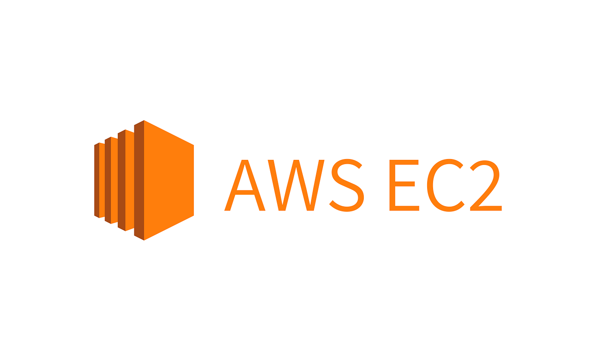
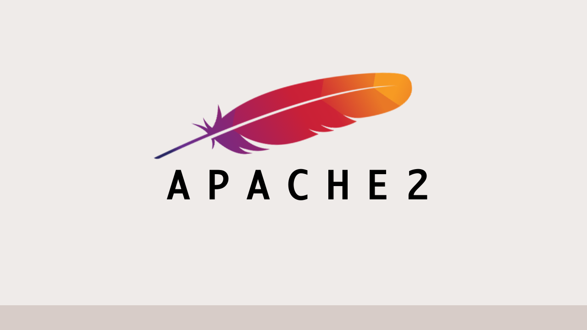
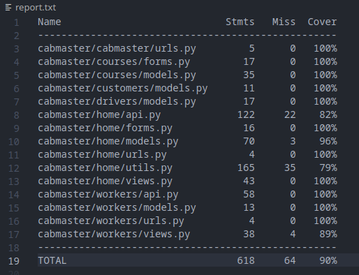

# Cabmaster's Website public repository

Professional showcase website for the Cabmaster company as well as a personnal dashboard for Admins / Partners.
**I have anonymized the files, enabling the repository to be made public.**

<a href="https://www.cabmaster.fr" target="_blank">Visit Website</a>


<div style="display: grid; grid-template-columns: repeat(auto-fit, minmax(150px, 1fr)); gap: 20px;">
    
    
    
    
    
    
    
</div>


## Tech Stack

Project: **Django, Javascript, HTML, Bootstrap CSS**

Server: **AWS EC2 Micro Instance under Debian 12**

Web Server: **Apache2**

CI-CD Pipeline: **Jenkins, Github Actions**

Databases: **Sqlite3, MariaDB**

Security: **Fail2Ban, Django decorators, Rate limits**

Tests (unit, integration, end-to-end): **Django.TestCase, Coverage**


## Description

### Context

This project is using **Django** as backend and its template language on front-end.

The front-end is made with **HTML / CSS** and enhanced with vanilla **Javascript**.

User inputs are controlled with **Javascript**, and form submissions / requests are sent through **Javascript** fetch in order not to require a page reload.

### Features

The website is a showcase site but has many pages as well as an admin dashboard and a partner dashboard panel with secure **authentication**.

Users can login and add / modify entries in the database **(CRUD)**.

Documents can also be generated through admin panel.

The website is fully responsive.

### Security

**Django** views and API endpoints have a rate limit protection, and the tests ensure that bad requests are handled correctly. Furthermore, Fail2ban is installed and setup on the server to prevent malicious attacks.

```python
@ratelimit(key="user_or_ip", rate="5/m")
@login_required(login_url="login")
def download_invoice(request, pk):
    pass
  ```


### Error Handling

Each view handles errors and returns the appropriate HTTP response. tests are very helpful to check every case.

```python
except IntegrityError as e:
    # Handle database integrity issues
    return JsonResponse(
        {"error": "Database integrity error", "message": e}, status=400
    )

except ValidationError as e:
    # Handle validation errors
    return JsonResponse(
        {"error": "Field Validation error", "message": e}, status=400
    )

except TypeError as e:
    # Handle type-related errors
    return JsonResponse({"error": "TypeError", "message": e}, status=400)

except ValueError as e:
    # Handle value-related errors
    return JsonResponse({"error": "ValueError", "message": e}, status=400)

except ObjectDoesNotExist as e:
    # Handle related object does not exist
    return JsonResponse(
        {"error": "Object does not exist error", "message": e}, status=400
    )
```

### CI/CD Pipeline & Deployment

CI/CD pipeline is managed through **Github Actions** and **Jenkins**. All **Tests (unit, integration and end-to-end)** are run with **Github Actions** thanks to a  **.yaml** file.

I also generate a tests report coverage with **Coverage**.



The report above shows that 90% of the code is covered by tests.

When the Dev branch is merged with the Main branch, github sends a webhook to **Jenkins**, and **Jenkins** deploys the website to the server by following instructions on a bash file.

I get success / errors alerts for each deploy to ensure everything goes right.


### About using Docker and Celery / RabbitMq + MariaDB

The database used is **SQLITE3** but I could use **MariaDB**. Unfortunately the server is not powerful enough.

I also tried to use a **Docker** container to have a more robust deployment as well as **Celery / RabbitMq** for task queue but once again the server is not powerful enough. 

Using a **Docker** container would enable me to make the deployment smoother and less error prone.

Celery and RabbitMq would enable me to perform certain tasks in background (for instance sending emails to users) and directly
return the HTTP response to the user while the task is being performed. (this is working locally)

Using an async view is not possible since *send_mail()* is a django built-in function that does not support async.

I think having a server with 3GB of RAM would be enough to use Docker and Celery / RabbitMq + MariaDB in a smooth way.
